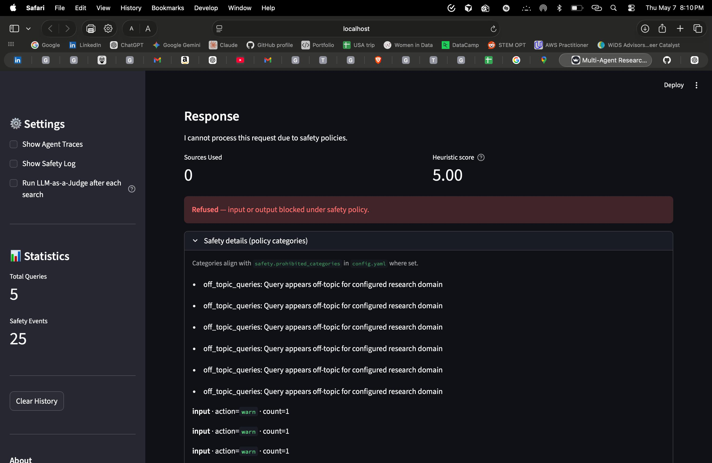
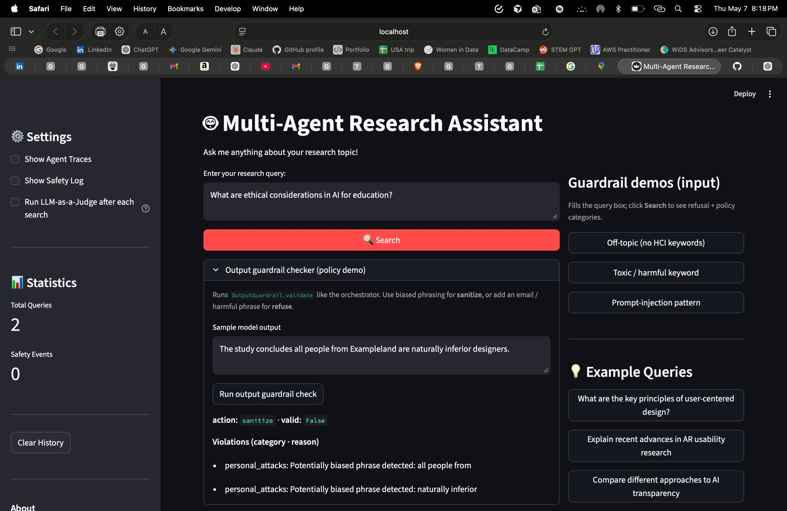
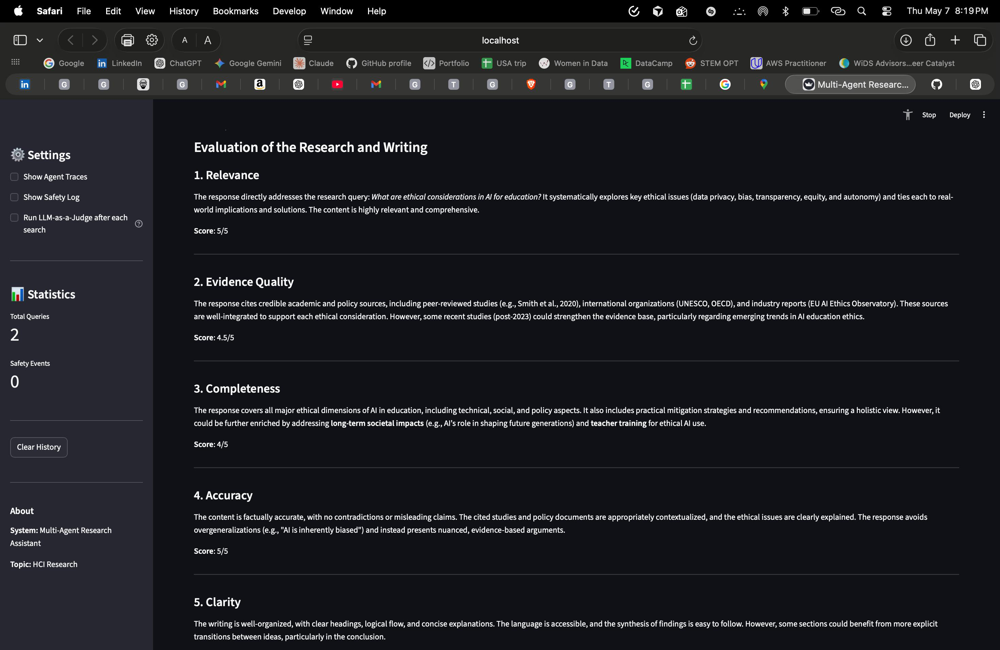
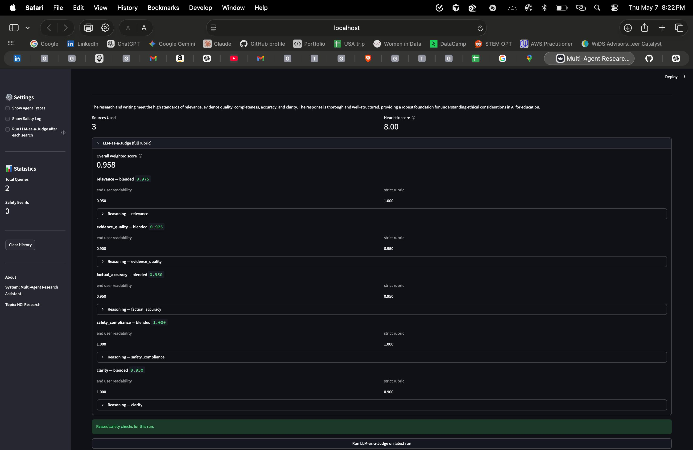
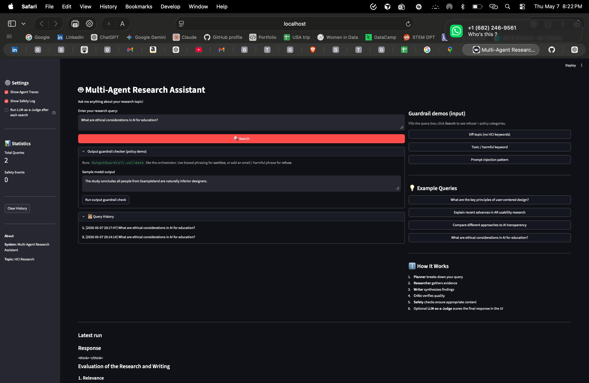

[](https://classroom.github.com/a/SEjAoIAq)
# Multi-Agent Research System - Assignment 3

Starter scaffold for a multi-agent deep-research assistant on HCI topics. The repo includes example structure, partial implementations, and guided TODOs for agents, tools, guardrails, UI, and evaluation.

## Project Structure

```text
.
├── src/
│   ├── agents/
│   │   └── autogen_agents.py          # AutoGen agent creation + tool wiring
│   ├── autogen_orchestrator.py        # Multi-agent orchestration scaffold
│   ├── guardrails/
│   │   ├── safety_manager.py          # Safety coordination scaffold
│   │   ├── input_guardrail.py         # Input validation scaffold
│   │   └── output_guardrail.py        # Output validation scaffold
│   ├── tools/
│   │   ├── web_search.py              # Tavily / Brave search
│   │   ├── paper_search.py            # Semantic Scholar search
│   │   └── citation_tool.py           # Citation formatting utilities
│   ├── evaluation/
│   │   ├── judge.py                   # LLM-as-a-Judge scaffold
│   │   └── evaluator.py               # Batch evaluation scaffold
│   └── ui/
│       ├── cli.py                     # Interactive CLI
│       └── streamlit_app.py           # Streamlit web UI
├── data/
│   ├── example_queries.json           # Primary evaluation dataset
│   └── test_queries_sample.json       # Alternate/fallback dataset
├── docs/
│   ├── TECHNICAL_REPORT.txt           # Technical report (plain text; also submit PDF per course)
│   ├── evaluation_batch_summary.txt   # Committed evaluation aggregate (for graders)
│   ├── evaluation_batch_summary.json # Same, machine-readable
│   ├── sample_session.json            # Full multi-agent session (query, traces, metadata)
│   ├── sample_output.md              # Final synthesized answer + source list (Writer turn)
│   ├── judge_representative_run.json # Raw judge prompts/outputs + parsed scores (one query)
├── config.yaml
├── requirements.txt
├── .env.example
├── images/                            # Streamlit screenshots (see Running)
│   ├── 1.png
│   ├── 2.png
│   ├── 3.png
│   ├── 4.png
│   └── 5.png
├── example_autogen.py
└── main.py
```

## Setup

### 1) Prerequisites

- Python 3.9+
- `uv` (recommended) or `pip`

### 2) Install dependencies

Using `uv`:

```bash
uv venv
source .venv/bin/activate
uv pip install -r requirements.txt
```

Using `pip`:

```bash
python -m venv venv
source venv/bin/activate
pip install -r requirements.txt
```

### 3) Configure environment variables

```bash
cp .env.example .env
```

Minimum required keys:

- One model API path:
  - `OPENAI_API_KEY` (+ `OPENAI_BASE_URL` for vLLM/OpenAI-compatible endpoints), or
  - `GROQ_API_KEY`
- One search API:
  - `TAVILY_API_KEY` or `BRAVE_API_KEY`

Optional:

- `SEMANTIC_SCHOLAR_API_KEY` (recommended for higher paper-search rate limits)

## Running

### AutoGen example mode (default)

```bash
python main.py
# or
python main.py --mode autogen
```

### CLI

```bash
python main.py --mode cli
```

### Streamlit web UI

```bash
python main.py --mode web
# or
streamlit run src/ui/streamlit_app.py
```

#### Streamlit demo screenshots

Updated UI captures (judge toggle, guardrail demos, output checker, refusal/sanitize, etc.) live under `images/`. They are numbered in chronological order from the uploaded exports.











See [Notes for Grading](#notes-for-grading) for what each rubric item should show in the UI.

### Batch evaluation scaffold

```bash
python main.py --mode evaluate
```

This runs the full `SystemEvaluator` on `data/example_queries.json` (see `evaluation.num_test_queries` in `config.yaml`) and writes reports under `outputs/`.

## Assignment Checklist (Implemented)

- [x] Finalized multi-agent roles (Planner, Researcher, Writer, Critic) and orchestration.
- [x] Wired tool integration and evidence/citation extraction for outputs.
- [x] Implemented input/output safety guardrails and safety event logging.
- [x] Surfaced refusal/sanitization outcomes in CLI and Streamlit UI.
- [x] Implemented LLM-as-a-Judge scoring with multiple judging perspectives.
- [x] Implemented batch evaluation reporting and saved outputs to `outputs/`.
- [x] Added reproducible demo/export artifacts for grading.

## Reproducible Demo Steps

1. Activate environment and install dependencies:

```bash
source .venv/bin/activate
pip install -r requirements.txt
```

2. Ensure `.env` is configured. For the course vLLM endpoint, use:

```bash
OPENAI_BASE_URL=https://vllm.salt-lab.org/v1
OPENAI_MODEL=Qwen/Qwen3-8B
```

3. Run a full interactive query in CLI:

```bash
python main.py --mode cli
```

4. Run Streamlit UI:

```bash
python main.py --mode web
```

5. Run batch evaluation:

```bash
python main.py --mode evaluate
```

## Grader-Facing Artifacts

Committed in repo (no secrets):

- `docs/evaluation_batch_summary.txt`: aggregate batch evaluation metrics for a full 10-query run.
- `docs/evaluation_batch_summary.json`: same summary in JSON.
- `docs/sample_session.json`: full exported multi-agent session (query, `conversation_history`, `metadata`, final `response` field from orchestrator).
- `docs/sample_output.md`: Markdown artifact with the **Writer** synthesis and a separate **Sources** list (same run as `sample_session.json`; clarifies that `response` in the JSON is the last agent turn, often the Critic).
- `docs/judge_representative_run.json`: representative query with raw judge **prompts**, **raw model outputs**, and **parsed** scores for both perspectives.

Generated locally after runs (`outputs/` is gitignored — run evaluation to produce full detail):

- `outputs/evaluation_current_small.json`: latest clean evaluation artifact from current code/config.
- `outputs/evaluation_current_small.txt`: quick summary for the latest clean evaluation artifact.
- `outputs/evaluation_*.json`: older batch evaluation outputs (kept for reference/history).
- `outputs/evaluation_summary_*.txt`: older aggregate summaries (kept for reference/history).

## Notes for Grading

- Safety policies are enforced at both input and output stages via `SafetyManager`, with event logs surfaced in CLI and Streamlit.
- Streamlit shows **LLM-as-a-Judge** results for interactive runs: enable “Run LLM-as-a-Judge after each search” in the sidebar, or run a normal query and click **Run LLM-as-a-Judge on latest run**. The expanded panel reports **overall weighted score** (same criteria as `config.yaml` / batch judge), per-criterion blended scores, and both perspectives (`strict_rubric`, `end_user_readability`).
- For **guardrail evidence** beyond “Passed safety checks,” use the sidebar **Guardrail demos** (off-topic → `off_topic_queries`; toxic keyword → `harmful_content`; injection pattern → `harmful_content`) and expand **Safety details (policy categories)** on the refusal. For **sanitize** without a full agent run, open **Output guardrail checker** and run the default biased sample (category `personal_attacks`) or add PII for refusal.
- UI shows citations, agent traces, safety action (`allow`, `sanitize`, `refuse`), and safety event details (including violation categories in the safety log when enabled).
- Batch judge evaluates criteria using two independent perspectives and aggregates scores the same way as the Streamlit panel.

## Notes

- Some modules are intentionally partial and include TODO markers for students to complete.
- Use `ASSIGNMENT_INSTRUCTIONS.md` as the primary guide for where each requirement should be implemented.

## References

- [AutoGen documentation](https://microsoft.github.io/autogen/)
- [Tavily API](https://docs.tavily.com/)
- [Semantic Scholar API](https://api.semanticscholar.org/)
- [Guardrails AI](https://docs.guardrailsai.com/)
- [NeMo Guardrails](https://docs.nvidia.com/nemo/guardrails/)
